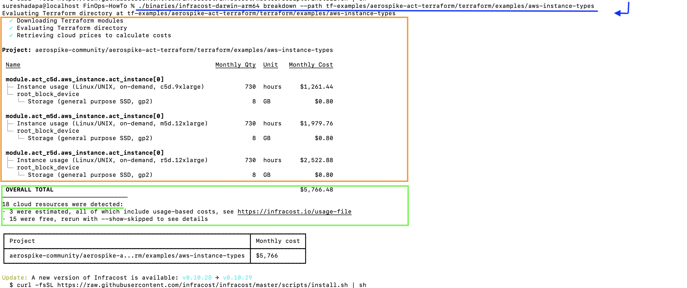

# FinOps-using-InfraCost

Why? empower engineering teams to use cloud infrastructure economically and efficiently.

#Decision

| TF-Name                 | Cloud  | Cost($)    | Remarks                     |
| ---                     | ---    | ---        | ---                         |
| Aerospike-quick-start   | AWS    | 89.97      |  730 hrs                    |
| Aerospike-quick-start   | GCP    | 87.12      |  730 hrs                    |
| Aerospike-instance-types| AWS    | 1261.44    |  730 hrs c5d.9xlarge        |
| Aerospike-instance-types| AWS    | 1979.76    |  730 hrs m5d.12xlarge       |
| Aerospike-instance-types| AWS    | 2522.88    |  730 hrs r5d.12xlarge       |
| Wordpress               | AWS    | 86.75      |  t3.xlarge                  |
| Wordpress               | AWS    | 54.04      |  t3.medium                  |
| Wordpress               | AWS    | 152.15     |  t3.large                   |

 

Depending upon the Operating System and the Arch-type, download the infracost binary.  
<u>Refer:</u>  
https://www.infracost.io/docs/#1-install-infracost and  
https://www.infracost.io/docs/#quick-start   

In my case am using MacBook Pro (chip M1, 2020) , so downloading the file below  

(to binaries folder - mkdir binaries, cd binaries).  
wget https://github.com/infracost/infracost/releases/download/v0.10.28/infracost-darwin-arm64.tar.gz

For Other Operating Systems and releases Refer:  
(https://github.com/infracost/infracost/releases)  

Example for version 0.10.28  
https://github.com/infracost/infracost/releases/tag/v0.10.28

Example for version 0.10.29  
https://github.com/infracost/infracost/releases/tag/v0.10.29
 

Extract the downloaded tar.gz file using tar command below  
sureshadapa@localhost binaries % tar -xzf infracost-darwin-arm64.tar.gz

Check/List for the files  
sureshadapa@localhost binaries % ls                                      
infracost-darwin-arm64		infracost-darwin-arm64.tar.gz  

Check if its an executable  
sureshadapa@localhost binaries % file infracost-darwin-arm64  
infracost-darwin-arm64: Mach-O 64-bit executable arm64  

Check Version  
sureshadapa@localhost binaries % ./infracost-darwin-arm64 --version  
Infracost v0.10.28  

If new version is available it would give update message like below  
sureshadapa@localhost binaries % ./infracost-darwin-arm64 --version  
Infracost v0.10.28

Update: A new version of Infracost is available: v0.10.28 → v0.10.29  
  $ curl -fsSL https://raw.githubusercontent.com/infracost/infracost/master/scripts/install.sh | sh  

If there is no new Version, it would give message like below  
sureshadapa@localhost binaries % ./infracost-darwin-arm64 --version  
Infracost v0.10.28  

#Download terraform examples  

Create a  folder for tf-examples (cd ../; mkdir tf-examples;cd tf-examples)  

Terraform examples are from below locations  
git clone https://github.com/aerospike/act  
git clone https://github.com/devbhusal/terraform-ec2-RDS-wordpress  

#Run and Compare the cost (decision))  

